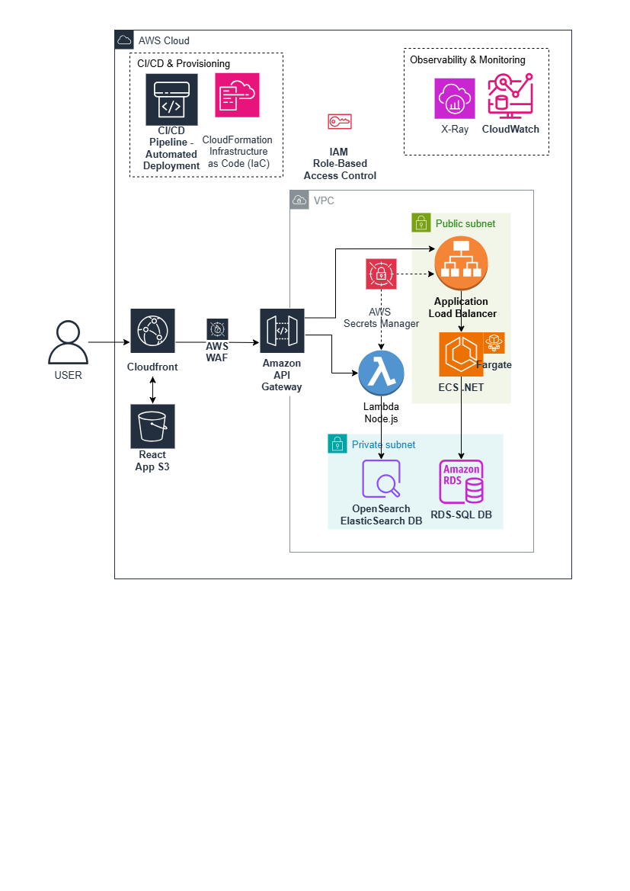

# 🛒 Shopping Store - Full Stack Enterprise System

מערכת מלאה מקצה לקצה לניהול חנות מקוונת, המשלבת ארכיטקטורת Microservices, חיפוש מתקדם ב-Elasticsearch וממשק משתמש מודרני.

## 🏗 ארכיטקטורת המערכת
הפרויקט בנוי משלושה רכיבים המקשרים בין טכנולוגיות שונות:

* **[Frontend (React)](./client):** ממשק הלקוח, מבוסס Vite ו-TypeScript.
* **[Order Service (Node.js)](./backend-node):** שירות ניהול הזמנות המקושר ל-Elasticsearch.
* **[Product Service (.NET 8)](./backend-dotnet):** שרת הליבה לניהול מוצרים וקטגוריות מול SQL Server.
---

## ☁️ תכנון ארכיטקטורה בענן (Cloud Architecture)
חלק מהותי מהפרויקט עוסק בתכנון המערכת לסביבת ענן מודרנית. כל חומרי התכנון מרוכזים בתיקיית `docs`:

* **🖼️ תרשים ארכיטקטורה:** ויזואליזציה של הרכיבים והקשרים ביניהם (AWS):
  

* **📄 [מסמך אפיון מפורט (Word)](./docs/AWS_Architecture.docx):** ניתוח מעמיק של הרכיבים, שיקולי Scalability ובחירת טכנולוגיות ענן.
* **📖 [מדריך ענן (README)](./docs/AWS_Architecture.md):** הסבר מהיר בפורמט Markdown על הארכיטקטורה המוצעת והיתרונות שלה.

ניתן לגשת לכל חומרי ההסבר כאן: **[מעבר לתיקיית התיעוד המלאה (Docs)](./docs)**

---
## 🏗 תשתיות ומסדי נתונים (Infrastructure)
כל קבצי הגדרת התשתית מרוכזים בתיקיית `/infrastructure` בשורש הפרויקט:

* **Docker & Elasticsearch:** הרצת Elasticsearch בקונטיינר באמצעות Docker Compose.
* **SQL Server:** סקריפט `db_script.sql` להקמת טבלאות המוצרים והקטגוריות.
* **Mapping:** הגדרת המפינג המקצועי (`orderMapping.ts`) נטענת אוטומטית על ידי שרת ה-Node.

## 🛠 טכנולוגיות
- **Client:** React 18, Vite, TypeScript, Tailwind CSS.
- **Backend Node:** Express, Elasticsearch Client, dotenv.
- **Backend .NET:** C#, ASP.NET Core Web API, Entity Framework.
- **Databases:** SQL Server (Products), Elasticsearch (Orders).

## 🏃‍♂️ הוראות הרצה למערכת המלאה

כדי שהמערכת תעבוד בצורה תקינה, יש להפעיל את הרכיבים לפי הסדר הבא:
1. **הפעלת מסדי נתונים ותשתיות**
- **Elasticsearch:** כנסו לתיקיית `infrastructure` והריצו:
  ```bash
  docker-compose up -d

2. **SQL Server**
: יש להריץ את סקריפט הקמת בסיס הנתונים שנמצא בתיקייה: `infrastructure/db-script.sql` בתוך SQL Server Management Studio.

3. **שרת הנתונים (Node.js):**
   - כנסו לתיקיית `backend-node`.
   - העתיקו את `.env.example` ל-`.env`.
   - הריצו `npm install` ולאחר מכן `npm run dev`.

4. **שרת הקטלוג (.NET):**
   - כנסו לתיקיית `backend-dotnet`.
   - ודאו שה-Connection String ב-`appsettings.json` תקין.
   - הריצו את הפקודה `dotnet run` (או דרך Visual Studio).

5. **ממשק המשתמש (React):**
   - כנסו לתיקיית `client`.
   - הריצו `npm install` ולאחר מכן `npm run dev`.
   - פתחו את הדפדפן בכתובת שתוצג (בדרך כלל `http://localhost:5173`).

---
מפתחת : מינדי רוזנבאום 2025 
